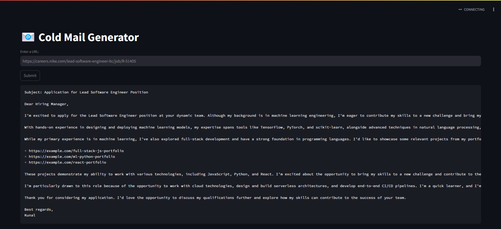
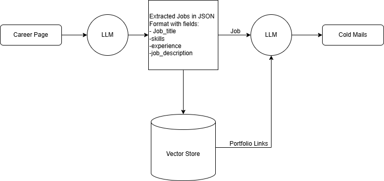

# 📧 Cold Mail Generator

A cold email generator built with **Groq**, **LangChain**, ** ChromaDB**, and **Streamlit**. This tool allows users to input the URL of a company's careers page, extracts job listings from that page, and generates personalized cold emails. The emails include relevant portfolio links sourced from a vector database, tailored to the specific job descriptions. This uses **Llama-3.3-70b-versatile** for inferencing.

## Use Case Example

Imagine this scenario:
- **Nike** is hiring a *Lead Software Engineer* and is investing time and resources in the hiring process, onboarding, and training.
- As an engineer, I can offer Nike a dedicated software development engineer. The AI agent crafts a cold email to reach out to Nike, pitching my skills and services.



## Architecture Diagram



## Setup Instructions

Follow these steps to get the Cold Mail Generator up and running:

1. **Obtain an API Key**  
   - Get your API key from [Grok Console](https://console.groq.com/keys).  
   - Open `app/.env` and update the `GROQ_API_KEY` value with your newly created API key.

2. **Install Dependencies**  
   Run the following command to install the required packages:
   ```bash
   pip install -r requirements.txt
   
3. Run the streamlit app:
   ```commandline
   streamlit run app/main.py
   ```
